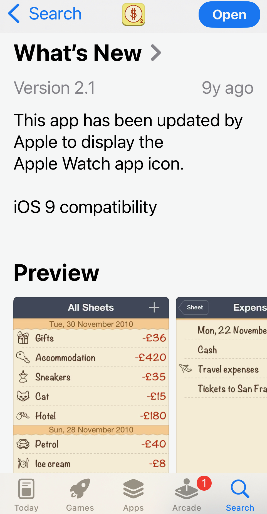

# smartbudget2

Once popular Smart Budget 2 app source code

I have no idea how to build this. It was developed using Microsoft Xamarin Studio, that's
why the source code in C#.

The idea was that it will somehow compile on Android and Windows.

The truth was the app had to be written every time for each platform anyway.

So this Xamarin technology was the greatest mistake of Smart Budget development.
Xamarin was quickly abandoned by Microsoft, leaving Smart Budget team with the need
to write the app again completely, which we started several times, but never finished.

Had we used XCode and Objective-C like every sane person, we'd be able to easily update
and modernize the app.

# App Removal 

It lived in Apple Store for 10+ years without updates, thanks to Apple API stability and decent coding quality.

Unfortunately, in the end of 2025 Apple notified that App is no more compatible with the future iOS,
so must be either updated or removed.

It was impossible to update, so it was removed by Apple.

It runs with minor problems (black stride at the top of the screen) on iOS 26.3.1 on my iPhone mini 12.